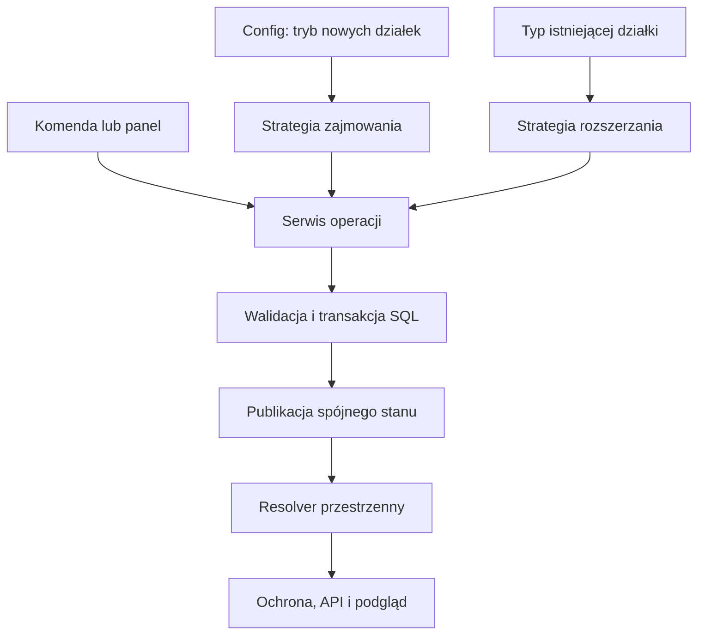

# 02 — Architektura i geometria

[Spis planu](README.md) · [Dane i migracja](03-dane-transakcje-migracja.md)

## 1. Mapa zmian w repozytorium

Ścieżki w tabeli są względne wobec `src/main/kotlin/pl/syntaxdevteam/plotsx/`.

| Obecny element | Zależność do rozwiązania | Planowana zmiana |
| --- | --- | --- |
| `databases/PlotData.kt` | `contains`, `area`, rozszerzanie opierają się na segmentach | Oddzielić metadane od geometrii. |
| `commands/ClaimCMD.kt` | Pobiera promień i przekazuje go do zapisu | Delegować przygotowanie kandydatury do aktywnej strategii. |
| `gui/ExpandGUI.kt` | Kierunki, rozmiar i cena klasycznych segmentów | Wspólny ekran renderujący ofertę właściwą dla typu działki. |
| `databases/DatabaseHandler.kt` | Zapytania `spatialPlots`, odczyty i sumy używają promienia | Wydzielić repozytorium geometrii i wspólną walidację transakcyjną. |
| `databases/OwnershipTransfer.kt` | Limit promienia i powierzchnia z segmentów | Liczyć rzeczywistą geometrię obu typów. |
| `cache/CacheManager.kt` | Cache działek, flag i członków publikowane oddzielnie | Wprowadzić spójny indeks geometrii i kontrolę rewizji publikacji. |
| `protection/PlotProtectionListener.kt` | Wyszukiwanie działki przez cache i `contains` | Jeden resolver przestrzenny dla wszystkich zdarzeń. |
| `api/PlotsXApi.kt`, `api/internal/DefaultPlotsXApi.kt` | Snapshoty ujawniają `radius` i rozszerzenia | Jawny kontrakt obu geometrii oraz wersjonowanie API. |
| `databases/Helpers.kt` | Rysowanie granic przez środek i promień | Wizualizacja rzeczywistych krawędzi obu typów. |
| `hooks/RegionProtectionHook.kt`, `hooks/WorldGuardHook.kt` | Test regionu przyjmuje środek i promień | Dodać dokładne granice prostokąta. |
| `databases/DatabaseSchema.kt`, `databases/SqlBackup.kt` | Schemat i eksport znają bieżące tabele | Typ geometrii, chunki, migracje i pełny eksport. |
| `common/ConfigHandler.kt`, `PlotsX.kt`, `loader/PluginInitializer.kt` | Synchronizacja configu i start usług | Walidacja struktury, wybór strategii, migracja przed ochroną. |

Dodatkowo przejrzeć wszystkie odwołania do `radius`, `segments`, `extensions`, `contains` i `getPlotAtLocation`, w tym GUI, dialogi, prywatne kontenery i testy. Sama wymiana ścieżki `/claim` pozostawiłaby niespójne odczyty.

## 2. Podział odpowiedzialności

Docelowy podział odpowiedzialności przedstawiono poniżej. Część geometrii i persystencji jest już zaimplementowana; dokładny zakres wskazuje [rejestr postępu](06-postep-implementacji.md). Lista nie oznacza gotowości wszystkich usług:

- `ClaimMode`: `CLASSIC`, `CHUNKS`; konfiguracja wybiera strategię nowych zajęć.
- `PlotGeometry`: wspólne operacje `contains`, `area`, `bounds`, `intersects` i dane do wizualizacji.
- `ClassicGeometry`: adapter dotychczasowego segmentu bazowego i rozszerzeń, bez zmiany matematyki.
- `ChunkGeometry`: niepusty zbiór unikalnych współrzędnych chunków jednego świata.
- `ClaimStrategy`: buduje kandydata nowej działki oraz prezentację jego rozmiaru.
- `ExpansionStrategy`: wybrana na podstawie zapisanej geometrii; buduje kandydata rozszerzenia.
- `ClaimService` i `ExpansionService`: wspólny przebieg uprawnień, limitów, oferty, zapisu i publikacji.
- `PlotRepository`: odczyt i atomowy zapis metadanych oraz właściwej geometrii.
- `SpatialPlotResolver`: wspólne wyszukiwanie dla ochrony, komend i API.

Nie należy rozrzucać warunków `if (mode == chunks)` po listenerach. Po utworzeniu działki jej obsługa zależy od danych, a nie od aktualnego configu.



## 3. Matematyka chunków

Dla całkowitych współrzędnych blokowych:

```kotlin
val chunkX = Math.floorDiv(blockX, 16)
val chunkZ = Math.floorDiv(blockZ, 16)
val minX = chunkX.toLong() * 16L
val maxX = minX + 15L
val minZ = chunkZ.toLong() * 16L
val maxZ = minZ + 15L
```

Zwykłe dzielenie całkowite przez 16 jest błędne dla ujemnych współrzędnych. Pozycję zmiennoprzecinkową należy najpierw zamienić na współrzędną bloku przez zaokrąglenie w dół, a nie przez obcięcie części ułamkowej.

| Blok X | Chunk X | Zakres X chunka |
| --- | --- | --- |
| -17 | -2 | -32…-17 |
| -16 | -1 | -16…-1 |
| -1 | -1 | -16…-1 |
| 0 | 0 | 0…15 |
| 15 | 0 | 0…15 |
| 16 | 1 | 16…31 |

Granice blokowe są domknięte. Obliczenia pośrednie wykonujemy w `Long`, a przed przekazaniem do API blokowego sprawdzamy zakres. Powierzchnia wynosi `256L * liczbaUnikalnychChunków`. Ochrona nie zależy od Y; przy operacjach wymagających wysokości używamy granic danego świata.

Nie kodować chunka jako `PlotSegment(radius = 8)`, ponieważ tworzy to 17 × 17 bloków. `radius = 7` tworzy 15 × 15. Wymagany jest osobny typ lub dokładny prostokąt z min/max.

## 4. Kolizje

| Para | Dokładna reguła |
| --- | --- |
| Chunk–chunk | Równe identyfikatory świata i współrzędne chunka. |
| Classic–classic | Dotychczasowe przecinanie segmentów. |
| Chunk–classic | Prostokąt chunka przecina co najmniej jeden klasyczny segment. |

Dla prostokątów domkniętych A i B przecięcie zachodzi, gdy `A.minX <= B.maxX && A.maxX >= B.minX && A.minZ <= B.maxZ && A.maxZ >= B.minZ`. Testujemy każdy rzeczywisty segment, nie tylko środek albo narożniki. Bounding box całej działki jest filtrem kandydatów, nigdy ostatecznym rozstrzygnięciem.

Światy muszą mieć wspólny, kanoniczny klucz w bazie i cache. Obecny zapis nazw należy zachować podczas tej zmiany, ale normalizację i wykrywanie nazw różniących się wielkością liter trzeba wykonać centralnie. Nie wolno uzależniać równości światów od kolacji konkretnej bazy. Przejście na UUID świata wymagałoby osobnej migracji.

## 5. Cache i ochrona

Indeks chunkowych działek: `WorldKey -> ChunkKey -> PlotId`, z oczekiwanym stałym kosztem wyszukania. Dla klasycznych można użyć indeksu chunków pokrywanych przez segmenty, zwracającego kandydatów do dokładnego `contains`. Bardzo duże klasyczne segmenty wymagają ograniczenia kosztu indeksowania lub osobnego indeksu prostokątów; nie alokować nieograniczonej liczby wpisów na podstawie promienia.

Resolver nie ładuje chunków i nie odpytuje SQL na każdą akcję gracza. Wszystkie listy działek, wyszukiwanie po lokalizacji i decyzje flag muszą używać tej samej wersji geometrii. Pełne odświeżenie uruchomione przed nowszą mutacją nie może później nadpisać jej wyniku; publikację kontroluje monotoniczna rewizja.

Zapis w SQL i cache nie są jedną transakcją. Od przyjęcia mutacji do publikacji chronimy rezerwowany obszar przed działaniami, które mogłyby ominąć nową ochronę. Po zatwierdzeniu SQL instalujemy kompletny snapshot działki, geometrii, flag i członków na ścieżce publikacji; dopiero potem zwalniamy rezerwację i wysyłamy sukces. Błąd publikacji utrzymuje blokadę obszaru do naprawy. Podczas startu nie dopuszczamy graczy do świata przed odbudowaniem ochrony.

Testy graniczne obejmują tłoki, płyny, eksplozje, lejki, przemieszczanie bytów i inne zdarzenia obsługiwane przez obecny listener. Źródło i cel zdarzenia mogą należeć do różnych geometrii; reguły flag zachowujemy.

## 6. API i zgodność

Obecne `PlotSnapshot` i `PlotRegionSnapshot` ujawniają geometrię przez promień. Nie mogą prawidłowo opisać chunka. Dodanie pól do kotlinowej `data class` wymaga oceny zgodności konstruktorów, `copy` i kodu już skompilowanych integracji; samo `@JvmOverloads` nie zapewnia pełnej zgodności.

Przyjąć wersjonowane API V2 z jawnym `geometryType`, dokładnymi regionami/chunkami, `area` i geometrią `contains`. Zachować ID działek oraz semantykę flag i ról. Nowa wersja odczytu musi zwracać oba typy, także przy `mode: classic`. Nie zwracać chunków jako przybliżonych kwadratów i nie ukrywać ich przez `null`.

Przed wydaniem ustalić na podstawie audytu integracji, czy dotychczasowy interfejs może pozostać jako poprawny adapter. Jeżeli nie, wydać jawnie niezgodną wersję API i zaktualizować konsumentów przed uruchomieniem chunków. To bramka wydania, a nie obietnica automatycznej zgodności binarnej. Weryfikacja: przykładowy konsument Kotlin i Java, w tym wcześniej skompilowany klient, testowany według deklarowanej polityki kompatybilności.
